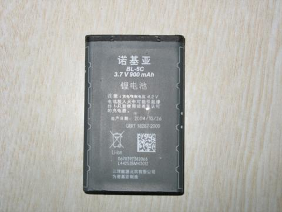

偶然听到一个关于手机电池的传说：\"把老化的电池用纸包好，放进冰箱里冻上两天，这个电池就会起死回生。\"去网上搜索一下，发现很多人都在介绍这个\"绝招\"，也有人表示质疑，但是好像没有人亲身试验过，刚好我昨天换下来的那块电池还在，就顺手试一试这个方法，如果管用当然最好，如果不好使（这个可能性最大），那就把这条流言给终结了吧。我的那块旧电池包好放在冰箱的冷冻室里等候试验结果！--由sbabybird于12/15/200709&#58;34&#58;00上午在从容地狂奔上发表电池放冰箱的实验结果
