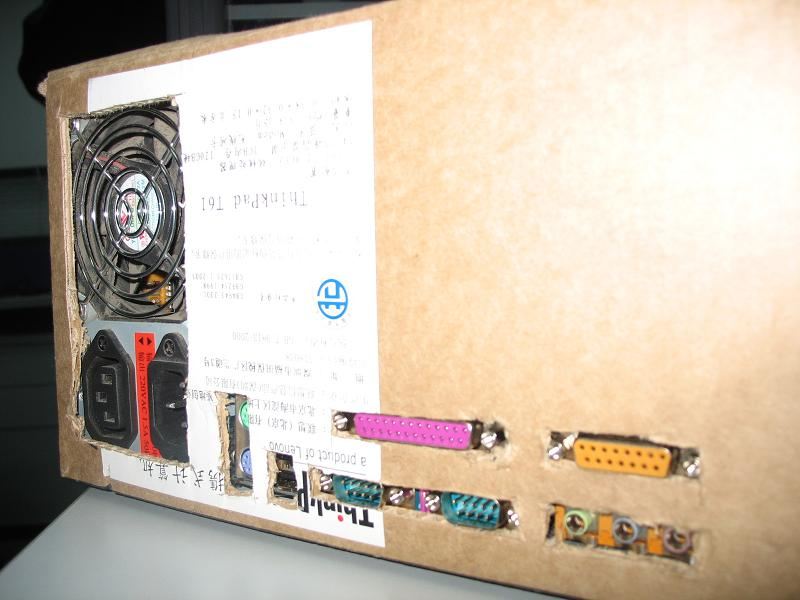
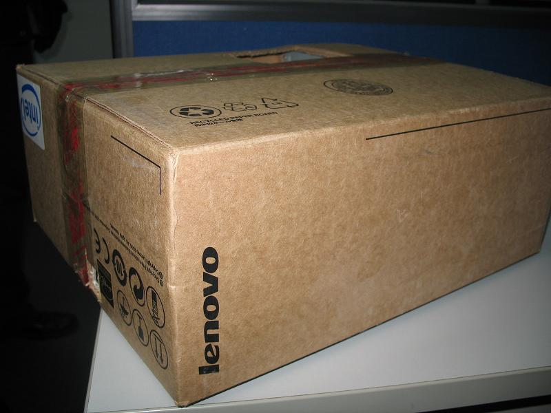
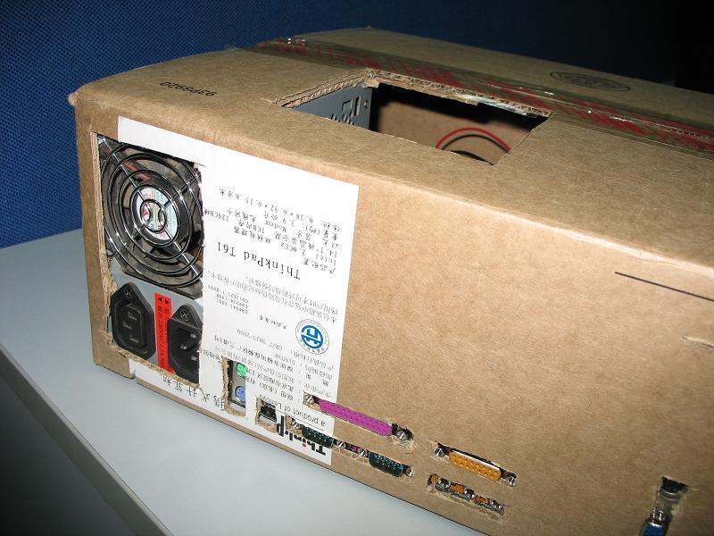
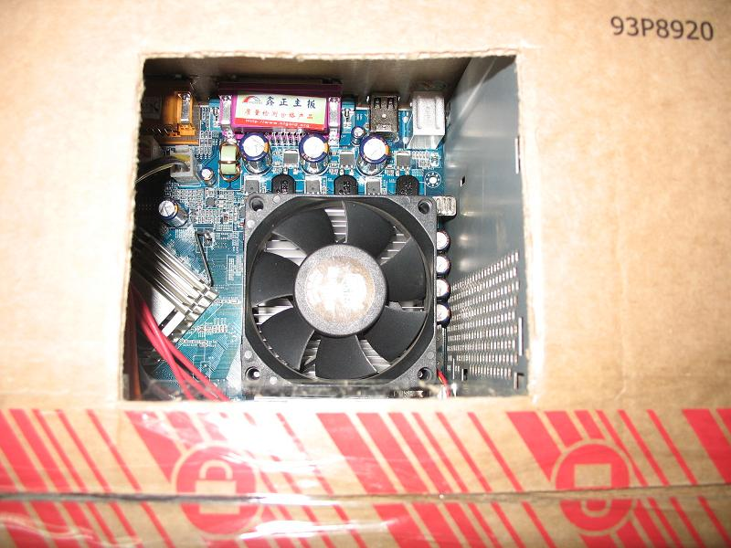

有句话说的好：\"牛人无处不在！\"公司一哥们儿用笔记本电脑的包装箱 DIY 了一个电脑机箱，用起来挺爽，就是不知道散热咋样儿！还有就是好像还没有加光驱。看起来挺象那么回事儿吧？呵呵，还是联想的纸箱子。放倒了再看看接口部分，该有的都有。千万别以为是联想新出的 pc 啊！为了给 cpu 散热，所以上面也开了个口 cpu 和 cpu 风扇--由 sbabybird 于 12/19/200705&#58;50&#58;00 下午在从容地狂奔上发表
