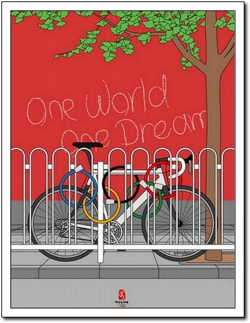

再过两天就要迎来激动人心的2008年了，时光如水，生命如歌，每一天都是崭新的，每一年都是十分有意义的。今天是2007年的最后一个工作日，此刻我想起了《甲方乙方》里的那句台词：\"1997年过去了，我很怀念它。\"2007年的工作依然是十分忙碌，工作占据了我生活中的大部分时间。由于长期缺乏锻炼，身体开始逐渐向亚健康状态发展。早饭经常不吃，晚饭又吃的太晚，导致消化系统不太好使，肠胃胃经常发出抱怨。最后吃了西药、中药若干，一日三餐再也不敢怠慢，肠胃才慢慢恢复正常。所以正是2007年我才认识到了健康的重要性，也更深刻地认识到了幸福的真谛！总之2007年对我来说是成长的一年、成熟的一年、有美好收获的一年（我很佩服我自己能认识到这些）。希望在2008年，我和我的家人都健康幸福！--由sbabybird于12/29/200704&#58;41&#58;00下午在从容地狂奔上发表
