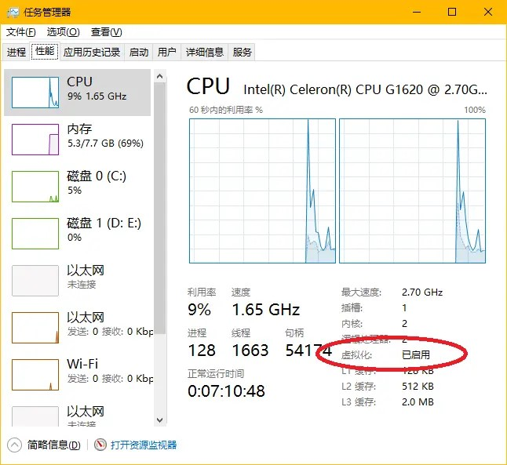
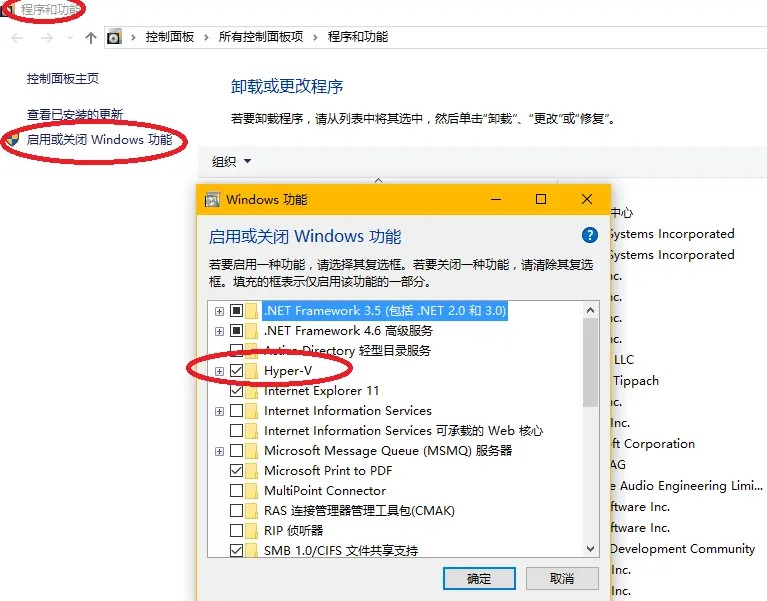
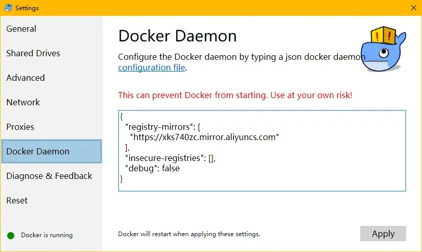
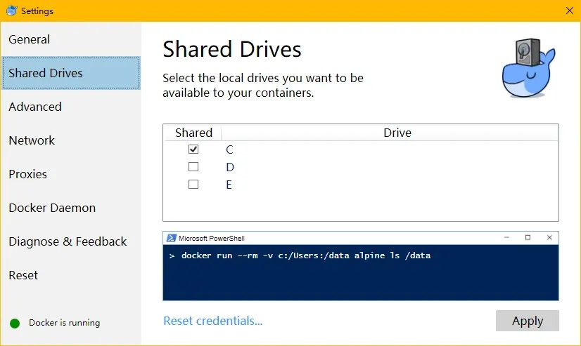

# 背景

配置开发环境是目前我们开发团队在进行开发工作之前的重要工作，对于需要使用我们自己封装的开发框架的 java web 程序员来说更是如此，一般来说需要配置 jdk、mysql、tomcat、maven 等一系列基础环境，如果需要使用我们现有的开发框架，还需要配置开发工程的模板、基础服务的访问地址、统一的环境参数等等。这些工作做起来比较繁琐，即使按照开发文档一步一步进行也容易出现差错，而且较为耗费时间。

Docker 容器技术的出现使得这一工作得以改进，通过一段时间的研究，我们的底层框架开发人员将以上环境全部使用 Docker 容器技术制作成为完整的镜像，使得业务开发人员不必再关心这些琐碎工作，只需通过 git 下载我们的工程模板，通过执行 Docker 命令自动在本地完成开发环境的构建。

然而由于 docker 是一个较新的技术，仍有很多开发人员没有接触过，上次我发的文章对于环境的配置描述的并不详细，这次专门针对 windows 下的开发者如何配置 docker 环境做一次讲解。如有必要，我将录制专门的视频来讲解。

# 认识 Docker

[Docker](https://www.docker.com/)是一种容器技术，可以在操作系统中隔离出若干个独立的程序运行环境，这些环境既可以共享宿主机的资源，另一方面他们之间相互独立，互不影响，也不会对宿主机的环境产生影响。与虚拟化技术不同的是，Docker 比较轻量级，容器（隔离运行环境）的启动和销毁都比较快，这些运行环境可以像现实世界中的集装箱那样，打包成一个一个的镜像，同样的镜像在不同的 Docker 环境中部署运行将会得到同样的结果，就像同一首歌在不同的播放器播放那样简单。

Docker 的出发点是将现在日趋复杂的 web 应用系统部署变得像播放唱片那样简单，但是它能做的却远不止于此，如果使用得当，我们将可以很容易实现“开发”、“测试”、“生产”环境的完全一致（这在以前是十分困难的），程序员以后也许再也说不出“这功能在我这儿好使”这样的话了。

作为开发者，如果认真思考过以上的问题，当遇到 Docker 这种容器技术时，应该很容易就想到针对自己工作的改进方案，并且加以利用。比如如果想尝试某一个新技术，以前可能需要在自己工作的操作系统上进行安装，不但配置麻烦，而且存在将自己的系统弄坏的风险（很多人还爱重装系统），现在不同了，只需要下载对应的镜像文件，然后启动容器，即可体验。无论是 golang、node、java、python 这些程序语言，还是 spark、wordpress、tomcat、mysql 这种应用环境，都已经有人封装好了即开即用的镜像，随时可以体验，而且用着不爽可以随时清理。

# 在 Windows 环境下的安装

如果是在 Linux 系统下干活，则比较简单，因为 Linux 已经实现对 Docker 技术的内核级支持，CentOS 的软件仓库自带了 Docker 最新版，可以直接通过命令安装使用。

对于 Windows 来说，稍有些困难，但是目前也不是问题了。首先需要看一下你的 Windows 环境，分两种情况，一种是 Windows 10 64 位专业版，一种是其他版本（比如很多人仍然推崇的 Win 7）。前者可以直接支持安装 Docker 原生版，性能最好，体验最佳，后者只能使用 Docker 官方提供的一种过度技术（Docker ToolBox），这种技术不得不依赖 Oracle 的 Virtualbox 以在你的系统里创建一个虚拟机用以模拟 Linux 运行环境，好在封装的比较好，基本可以忽略这个虚拟机的存在，只需专心使用 Docker 即可。

## 在 Windows 10 64 位专业版的安装

这个最简单，需要确定两个基础环境：

- 你的 CPU 支持虚拟化（一般都支持，如果在操作系统中没看到，则可以手动到 BIOS 里打开，如果实在不支持，换台新的电脑吧），具体可以通过任务管理器查看，如图
  

- 你的操作系统需要开启 Hyper-V，如图
  

然后到[官方网站下载安装包](https://download.docker.com/win/stable/InstallDocker.msi)直接安装即可，有时候可能存在网站被墙的情况，也可以到我上传的网盘里下载，[链接在此](https://yunpan.cn/cMRZNp6BaXeEF) https://yunpan.cn/cMRZNp6BaXeEF 访问密码 80e6

## 非 Windows 10 64 位专业版（无法使用原生 Docker）的安装

这个稍微麻烦，也需要确定两个基础环境：

- 你的 CPU 支持虚拟化
- 你的操作系统需要关闭（注意是关闭！）Hyper-V

然后到[官方网站下载安装包](https://github.com/docker/toolbox/releases/download/v1.12.0/DockerToolbox-1.12.0.exe)，如果网站被墙，可以访问[这个地址](https://get.daocloud.io/toolbox/)，也可以到我上传的网盘里下载，[链接在此](https://yunpan.cn/cMSaWneaYPE5K)https://yunpan.cn/cMSaWneaYPE5K 访问密码 c8fa

安装过程无特别之处，需要注意的是，如果你的系统内没有安装过 Oracle Virtualbox，安装程序会自动给你安装一个，不用理会，直接一直点击“下一步”即可。安装完成后直接点击快捷方式“Docker Quick Start”即可，如果是第一次运行，将会耗费一些时间（因为需要创建虚拟机），在这个过程中，系统可能会弹出若干次 UAC 提示让你授权，果断点击“同意”即可。

# 环境的配置和使用

安装完成之后，就可以随意使用了，但是，受国内网络环境的影响，还有一些需要调整，因为在国内访问国外的镜像库（docker 默认的那个）比较慢，一般镜像又都比较大（动辄几百兆），所以我们还需要配置一个国内的镜像仓库，推荐 DaoCloud 或者阿里云的，这里以阿里云举例。

## Windows10 下的镜像仓库配置

原生的 Docker 配置比较简单，官方还提供了可视化的配置界面，操作步骤如下：

- 右键点击系统托盘的 Dcoker 图标，选择 Settings
- 进入 Docker Daemon 选项，在右侧窗口填入镜像仓库的地址（可以自行去阿里云申请，我这里有一个示例）
- 示例如图
  

配置完成后，在命令行窗口执行一个拉取镜像的命令（`docker pull tomcat`）试试看，会发现速度杠杠的。

## DockerToolbox 镜像仓库的配置

这个略微麻烦一些，不过还可以接受，需要在命令行进行操作：

- 先执行这个命令（镜像地址可以自行替换）`docker-machine ssh default "echo 'EXTRA_ARGS=\"--registry-mirror=https://xks740zc.mirror.aliyuncs.com\"' | sudo tee -a /var/lib/boot2docker/profile"`
- 再执行这个命令 `docker-machine restart default` 会重启 Docker 虚拟机
- 然后执行命令`docker-machine ssh default` 即可进入 docker 命令行环境了

## 关于 DockerToolbox 的特殊之处

- 在容器中暴露的应用端口，需要注意，他的访问地址不是你的主机 localhost，而是一个虚拟机的 ip 地址，一般为 192.168.99.100，如果你在容器中跑起来一个 web 程序并且暴露了 8080 端口，那么想在外面访问的话，地址为http://192.168.99.100:8080 ，如果是 win10 下的原生 docker 就会没有这个迷惑，直接 localhost 了。
- 共享宿主机的文件给容器，需要注意，我们在使用容器时，一般会通过挂载卷的形式将系统的文件共享给容器使用，对于 DockerToolbox 来说，它默认给你设置了系统盘的 User 文件夹具有可以挂载共享文件的能力，也就是说，你需要使用挂载卷的时候，必须确保文件在这个根目录之下（比如放在 C:/Users/xxx/Dcouments/xxxx）。
  如果是 window10 系统的原生 docker 技术则可通过图形设置界面完成，如图
  
