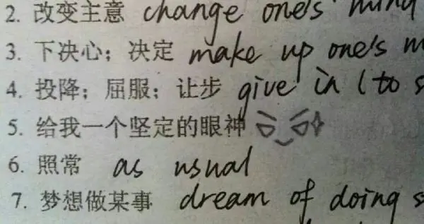
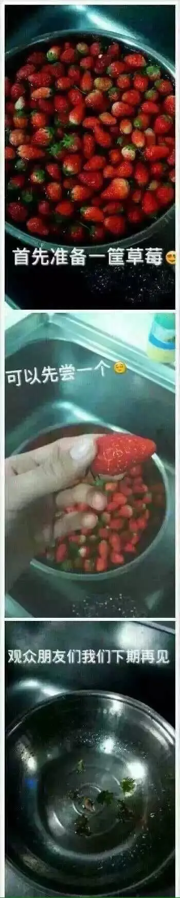
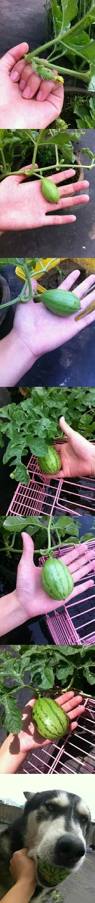

一些老段子，放松一下（来自知乎https://www.zhihu.com/collection/124380021?page=2）

### 给我一个坚定的眼神！

### 无题

### 怎样制作草莓酱

### 能让你产生强烈情绪的图片

### 填空题

小学时有道关联词填空：
他（ ）牺牲生命，（ ）出卖组织。
有人填“宁可 也不”；有人填“害怕 ， 所以”；
有人填“与其 不如”；有人填“即使 ，也要”；
更有个人全校出名，他填的“白白， 忘了”。
评论里有个清新脱俗，苦大仇深的，他填“大舅，二舅”！
