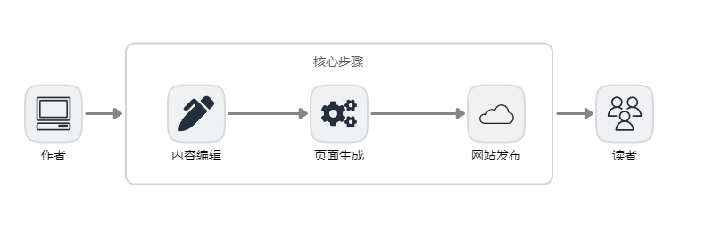
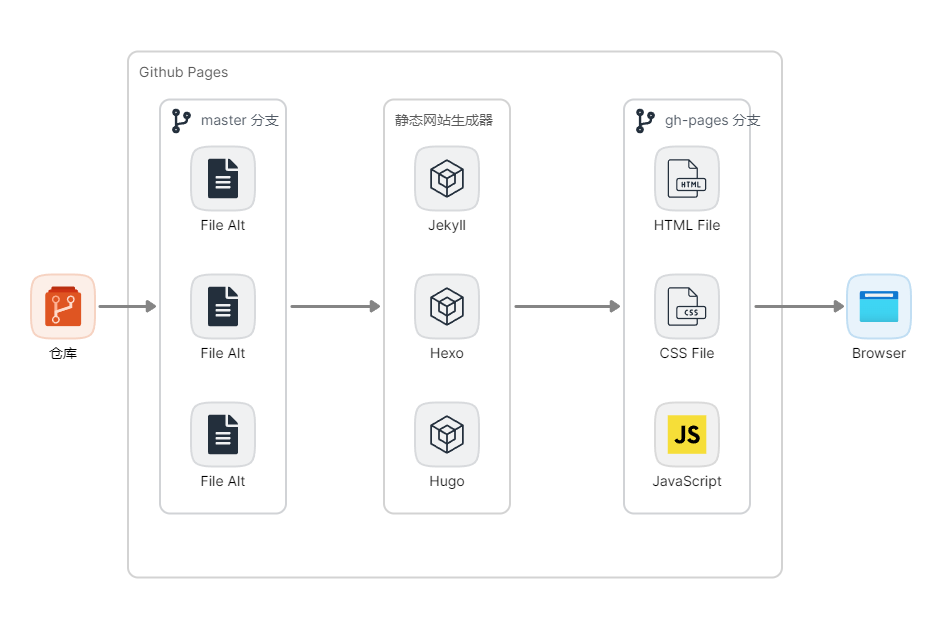

## 背景

搭建独立博客网站的方法多种多样。常规方法包括购买或租用服务器并自行架设和管理，或者选择托管服务商提供的博客发布服务。

但是上述两种方式都会产生一定费用，对于非盈利网站而言，不太友好。

经过多年的实践，现在已有越来越多的人选择了使用免费且易用的[ GitHub Pages ](https://docs.github.com/zh/pages/getting-started-with-github-pages/about-github-pages)服务来搭建个人博客。

然而，现有的使用教程大多侧重于操作步骤，对于新手或非专业人士而言，难以真正理解其中原理。

他们可能看到别人的博客既漂亮又实用，却在自己尝试搭建时屡屡遇到挫折，逐渐失去信心。

这无疑会打击那些希望通过博客持续创作文字、并且希望能够免费建立个性化站点的人的积极性。

本文将介绍如何使用 GitHub Pages 服务搭建免费的个人博客网站，及其背后的实现原理，以帮助初学者顺利建立自己理想的博客站点。

### 需要预先掌握的技能和前置条件
- 了解 Git 的概念和常用的操作，知道“分支”、“提交”、“推送”、“拉取”等概念。
- 拥有 Github 账号，并且能够独立完成“仓库创建”、“本地克隆”、“提交”、“推送”等操作。
- 了解“博客”本身只是一种“网站”：其内容由若干“网页”组成，读者通过浏览器访问博客网站所在的服务器以获取这些网页内容。

## 核心思路

简单来说，核心步骤只有三步：内容编辑、页面生成、网站发布。接下来的介绍均围绕这三件事展开。

### 内容编辑
编写和编辑博客内容，作者编写文章、给文章配图、给文章归类等等活动都属于内容编辑。

是产生数据的源头。此时如果不进行接下来的工作，也可将内容当作本地成果进行存档。

### 页面生成
如果希望将成果共享，则需要使用工具（一般为[静态网站](https://baike.baidu.com/item/%E9%9D%99%E6%80%81%E7%BD%91%E7%AB%99/2776875)生成器）将编辑的内容自动生成可供浏览器显示的博客网站页面。

### 网站发布
有了网站页面，还只是一堆存放在本地的文件。若要放到互联网上进行访问，还需要一个服务器提供服务，将网站发布。

如果采用独立建站的方式，这一步骤会涉及大量技术工作，比如服务器采购、Web服务应用程序安装、域名映射、SSL 安全证书、网络防火墙配置等等。

但由于我们的技术路线采用了 Github 提供的 Pages 服务，将大大降低上述操作的难度，很多技术类工作将不再考虑，已经由 Pages 默认提供，我们只需享用配置好的环境即可。

### 技术路线

#### Github Pages
Github 本来是一个 Git 仓库托管服务商，以帮助用户进行项目代码及数字资料的版本管理为主。不过后来随着用户规模越来越大，Github 也围绕版本管理提供了更多的辅助服务，这其中就包括 [Pages 服务](https://docs.github.com/zh/pages/getting-started-with-github-pages/about-github-pages)。

> GitHub Pages 是一项静态站点托管服务，它直接从 GitHub 上的仓库获取 HTML、CSS 和 JavaScript 文件，（可选）通过构建过程运行文件，然后发布网站。 可以在 GitHub Pages 示例集合中看到 GitHub Pages 站点的示例。

Pages 服务原本用于帮助托管在 Github 上的开源项目更便捷地发布自己的宣传页面。开发团队可以简单编写几个静态页面（HTML）然后放在托管的 Git 仓库中，由 Github 将这些页面以 HTTP 服务的方式发布出去，Github 既提供了服务器资源也提供了用于访问的二级域名地址（一般以你的账号命名）。

*甚至你也可以使用自己购买的域名，不过这涉及到更复杂的话题和操作，不在本文讨论范畴。*

具体步骤及原理：
  1. 用户编辑好博客内容，形成保存在本地计算机的原始文档文件。
  2. 使用静态网站生成器将本地原始文档文件生成静态页面文件。
  3. 将静态页面文件推送到预先指定的 Github 远端托管仓库。
  4. Github Pages 服务自动被触发，将静态页面以网站形式发布出来。
  5. 用户通过指定 URL 地址访问已发布的博客内容。

*静态网站生成器的概念不在这里详述，其主要功能是将一种约定格式的文本文件（通常为Markdown），转换成为可以被发布到网站服务中被浏览器识别解析的静态 HTML 文件。*

其中，为了方便，Github 提供了一个默认的静态网站生成器，上述第 2 步操作实际上可以在远端仓库自动执行，这样用户只需将原始文件上传至远端仓库即可，由 Github 直接在线上完成静态页面的生成和网站发布工作。

#### Jekyll

#### Hexo

#### Hugo
- 主流技术路线介绍：Jekyll、hexo、hugo，优劣，个人选择；

## 操作步骤

- 实现步骤：选择模板创建仓库、配置、本地预览（可选）、提交并生成、Pages 设置与发布、后续维护和编写文章的补充（介绍分类与命名规范）；

## 总结
