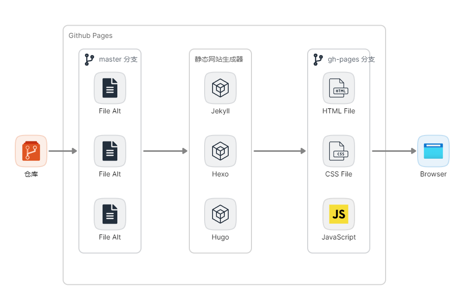
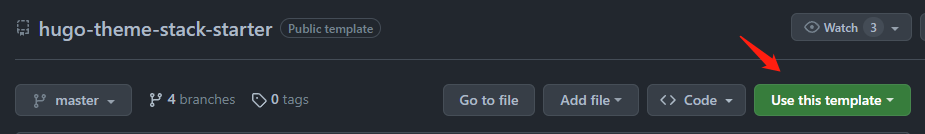
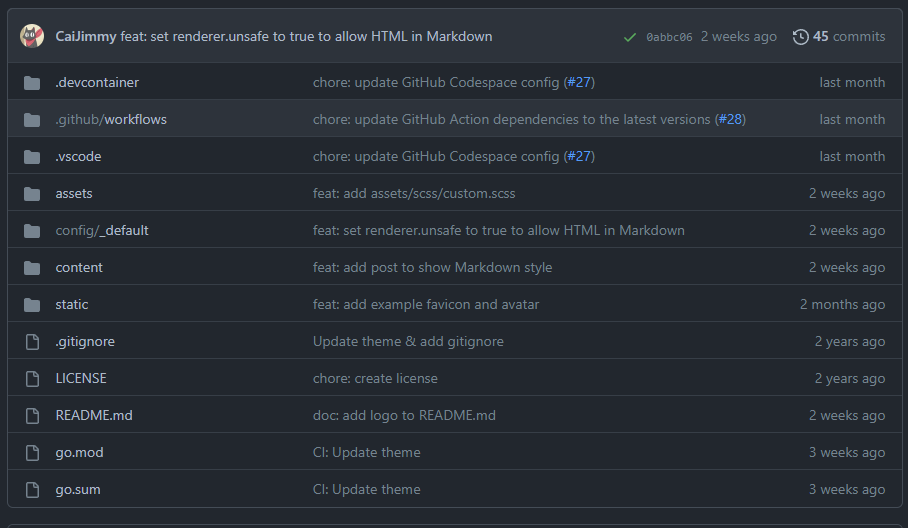
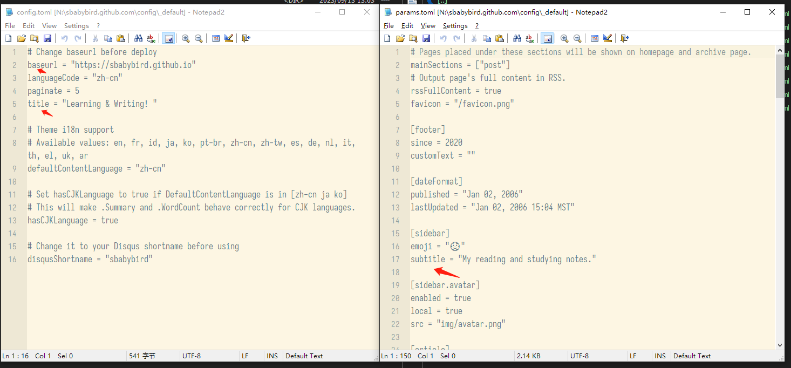
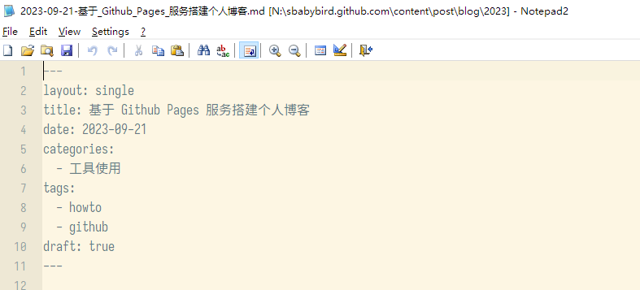
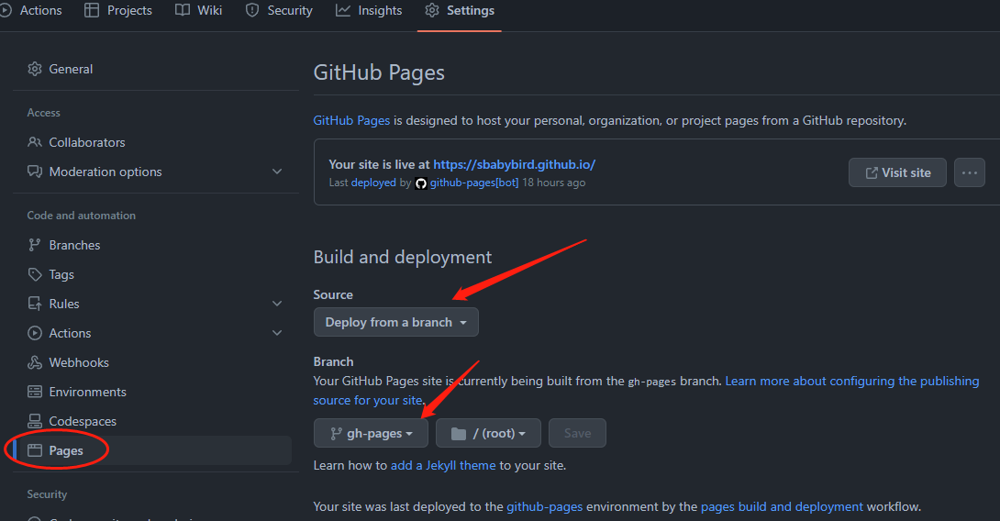
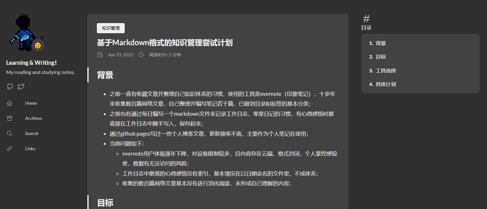

## 背景

搭建独立博客网站的方法多种多样，常见的方法包括租用服务器自行架设，或者选择托管服务商提供的博客发布服务。

但是上述两种方式都会产生一定的费用，对于非盈利网站而言，不太友好。

经过多年的实践，现在已有越来越多的人选择了使用免费且易用的[ GitHub Pages ](https://docs.github.com/zh/pages/getting-started-with-github-pages/about-github-pages)服务来搭建个人博客。

然而，现有的使用教程大多侧重于操作步骤，对于新手或非专业人士而言，难以真正理解其中原理。

他们可能看到别人的博客既漂亮又实用，却在自己尝试搭建时屡屡遇到挫折，逐渐失去信心。

这无疑会打击那些希望通过博客持续创作文字、并且希望能够免费建立个性化站点的人的积极性。

本文将介绍如何使用 GitHub Pages 服务搭建免费的个人博客网站，及其背后的实现原理，以帮助初学者顺利建立自己理想的博客站点。

### 需要预先掌握的技能和前置条件
*需要先了解这些再往下阅读本文*
- 了解 Git 的概念和常用的操作，知道“分支”、“提交”、“推送”、“拉取”等概念。
- 拥有 Github 账号，并且能够独立完成“仓库创建”、“本地克隆”、“提交”、“推送”等操作。
- 了解“博客”本身只是一种“网站”：其内容由若干“网页”组成，读者通过浏览器访问博客网站所在的服务器以获取这些网页内容。

## 核心思路

简单来说，核心步骤只有三步：内容编辑、页面生成、网站发布。接下来的介绍均围绕这三件事展开。

### 内容编辑
作者编写和编辑博客内容，包括编写文章、给文章配图、给文章归类等等活动都属于内容编辑。

### 页面生成
如果希望将内容变成可发布的网站，则需要使用专用的软件工具（一般为[静态网站](https://baike.baidu.com/item/%E9%9D%99%E6%80%81%E7%BD%91%E7%AB%99/2776875)生成器）将编辑的内容自动生成可供浏览器显示的博客网站页面。

### 网站发布
有了网站页面，还只是一堆存放在本地的文件。若要放到互联网上进行访问，还需要一个服务器提供服务，将网站发布。

如果采用独立建站的方式，这一步骤会涉及大量技术工作，比如服务器采购、Web服务应用程序安装、域名映射、SSL 安全证书、网络防火墙配置等等。

但我们今天选择使用 Github 提供的 Pages 服务，这将大大降低上述操作的难度，很多技术细节将不必再多关注，已经由 Pages 服务默认配置好。我们只需享用配置好的环境即可。

### 技术路线

#### Github Pages
Github 本来是一个 Git 仓库托管服务商，帮助用户进行项目代码及数字资料的版本管理。不过随着用户规模提升，Github 也围绕版本管理提供了更多的辅助服务，这其中就包括 [Pages 服务](https://docs.github.com/zh/pages/getting-started-with-github-pages/about-github-pages)。

> GitHub Pages 是一项静态站点托管服务，它直接从 GitHub 上的仓库获取 HTML、CSS 和 JavaScript 文件，（可选）通过构建过程运行文件，然后发布网站。 可以在 GitHub Pages 示例集合中看到 GitHub Pages 站点的示例。

Pages 服务原本用于帮助托管在 Github 上的开源项目更便捷地发布自己的宣传页面。开发团队可以简单编写几个静态页面（HTML）然后放在托管的 Git 仓库中，由 Github 将这些页面以网站服务的方式发布出去，Github 既提供了服务器资源也提供了用于公网访问的**专属 URL** 地址。

关于发布网站的**专属 URL** 地址的提供规则，Github 官方的介绍如下：

> 若要发布**用户站点**，必须创建名为 `<username>.github.io` 的个人帐户拥有的存储库。 若要发布**组织站点**，必须创建名为 `<organization>.github.io` 的组织帐户拥有的存储库。 除非使用的是自定义域，否则用户和组织站点在 `http(s)://<username>.github.io` 或 `http(s)://<organization>.github.io` 中可用。
> **项目站点**的源文件与其项目存储在同一个仓库中。 除非使用的是自定义域，否则项目站点在 `http(s)://<username>.github.io/<repository>` 或 `http(s)://<organization>.github.io/<repository>` 中可用。

根据官方介绍，Pages 提供有三种不同的网站发布服务：用户站点、组织站点、项目站点。

分别对应了“制作个人网站”、“制作团队组织网站”、“制作单个项目网站”的不同需求。

针对个人博客的搭建，很显然使用 Pages 服务发布“用户站点”是最合适的选择。

对于“用户站点”，Pages 最终会为用户提供的专属 URL 地址为：`https://你的用户名.github.io`，也就是说在 Gihtub 的一级域名 `https://github.io` 下给你免费提供了一个二级域名。之所以默认使用你的 Github 用户名，是因为要防止不同用户发布的地址重名导致冲突。

*按照官方介绍，你也可以使用自己购买的域名，通过自己的域名进行访问。不过这涉及到更复杂的话题和操作，不在本文讨论范畴。*

了解了以上基本信息后，在使用 Pages 服务时，可按照复杂度区分，采用如下几种不同的用法。

##### 最简单直接的使用流程
1. 手工编写 HTML 页面文件（需要掌握网页制作知识）。
2. 将页面文件推送到的 Github 仓库，对于“用户站点”来说，这个仓库的命名必须为“`你的用户名.github.io`”。
3. 在 Github 中设置该仓库的 Pages 服务配置，主要是选择仓库的指定“分支”用于 Pages 服务获取待发布的网页文件。
4. Github 会按照上面介绍的规则给你提供一个 URL 访问地址（`https://你的用户名.github.io`），使用浏览器打开该地址即可访问到发布的网站了。

*注：如果不理解 Git 仓库的“分支”概念，可以把它视为同一个仓库里不同的存储位置，不同的“分支”里面存储了不同的文件内容。*

这个流程仅适用于非常简单网站发布，比如只包含有一个页面，因为手工编写 HTML 页面的效率十分低下，且不利于持续更新维护。

于是大家常用的方式是，使用一种叫做的东西，对于“博客”这类以静态页面为主的网站，十分适合。

“静态站点生成器”可以理解为是一个“翻译”，它能自动将你编写的文本内容根据预先的配置信息，自动生成一个完整的网站所需的全部文件（HTML、JS、CSS等）。

于是有了如下的改进流程：

##### 改进的使用流程
  1. 用户编辑好博客内容，形成保存在本地计算机的原始文档文件。
  2. 使用静态网站生成器将本地原始文档文件生成静态页面文件。
  3. 将静态页面文件推送到 Github 远端托管仓库。
  4. Github Pages 服务自动被触发，将静态页面以网站形式发布出来。
  5. 用户通过指定 URL 地址访问已发布的博客内容。

到目前为止，已经可以较为流畅地执行博客编辑、生成、发布的工作流程了。

但是这个流程里有个前置条件，作者必须在本地电脑上安装一个“静态站点生成器”，以用于输出转换后的、可供发布的页面。

所以，为了方便，Github 提供了一个默认的静态网站生成器，上述第 2 步操作实际上可以在远端仓库自动执行，这样用户只需将原始文件上传至远端仓库即可，由 Github 直接在线上完成静态页面的生成和网站发布工作。



##### 静态站点生成器的选择
比较常见的静态站点生成器有：[Jekyll](https://jekyllrb.com/)、[Hexo](https://hexo.io/index.html)、[Hugo](https://gohugo.io/) 这三个。不在这里详细介绍了，因为功能都大同小异。在选定一个之后，需要去他们的官网查看文档以了解具体的使用细节，以便对自己的博客站点能够做到更深的定制。

我在接下来的操作步骤里，选择使用 Hugo 这个生成器。

主要原因是，Hugo 提供有相对来说比较美观的[免费主题风格模板](https://themes.gohugo.io/)（Jekyll 也有漂亮的，但是收费。Hexo 的定制性很强，适合有网页开发能力的人自己开发主题）。

我选择的主题模板是：[hugo-theme-stack](https://themes.gohugo.io/themes/hugo-theme-stack/)。


## 操作步骤
### 建立 Github 仓库
1. 进入 [hugo-theme-stack 的 Git 仓库模板](https://github.com/CaiJimmy/hugo-theme-stack-starter)。
2. 点击页面中的“使用此模板”按钮，以创建你自己的仓库（注意：需先登录自己的账号才能创建）。
   
3. 建立好仓库（注意仓库命名为`你的用户名.github.io`）之后，会自动带有仓库模板的初始文件。
   
### 修改配置
1. 将仓库下载到本地。
2. 打开仓库里的 config 文件夹，里面存放有配置信息。
3. 按照 [hugo-theme-stack 的官方文档](https://stack.jimmycai.com/guide/getting-started)配置自己想要的效果（默认一般都够用，重点是修改自己的站点信息，如显示名称、URL 链接地址等等）。
   
   *这些配置主要在 `config.toml` 和 `params.toml` 两个文件里。*

### 编写博客文章
生成器会默认去仓库的 `content/post/` 文件夹下扫描其下面的所有文件夹和文件，遇到约定格式的 `Markdown` 文件就会转换成为可发布的 `html` 页面。具体约定可以查看官方的详细文档，这里介绍一种最简单的写一篇文章的过程。

1. 在 post 目录下新建一个文件夹用于存放文章的 Markdown 文件和插图文件，文件夹命名为希望编写的标题如：`2023-09-21-怎样搭建个人博客`。*我个人习惯将不同年份的文章在post目录下再建一级目录按照日期或年份进行区分。*
2. 在刚建立的文件夹下新建名称为`index.md`的 Markdown 文件，文件名必须为 index.md 这是由 hugo 生成器约定的。
3. 在刚建立的 Markdown 文件的头部添加必要的元信息（非常关键）。
    ```yaml
      ---
      title: 文章标题
      date: 2023-09-21
      categories:
        - 文章所属分类
      tags:
        - 文章标签 1
        - 文章标签 2
      ---
    ```
    
4. 编写文章内容。可以使用 [Markdown 的语法](https://markdown.com.cn/basic-syntax/)随意定义格式，以及插入图片。插入的图片建议保存在同级目录（也就是刚才新建的那个）中。 

### 推送到仓库及发布
1. 将刚才修改配置文件保存。
2. 将刚才编写的博客文章保存。
3. 在本地提交 commit 并 push 到 Github 仓库。
4. 稍等几分钟（给 Github 那端的 Hugo 生成器留出运行时间）。
5. 在 Github 仓库的 “setting” 设置页面开启 Pages 服务（只需第一次）。
6. 在 Pages 设置界面里的 Source 中选择 “Deploy from a branch” ，并在下面的分支选择下拉框中选择 “gh-pages”，保存。
   

### 访问你的博客站点
一般稍等几分钟之后，即可按照约定网址访问刚发布的内容了。


## 扩展阅读

运营自己的博客网站所需了解的概念和知识相对比较多，如果希望将自己的网站做的更加精美、有特色。

除了能够持续产出高质量内容之外，建议阅读以下文章以了解相关知识：
- [学习 web 开发](https://developer.mozilla.org/zh-CN/docs/Learn/Getting_started_with_the_web)。